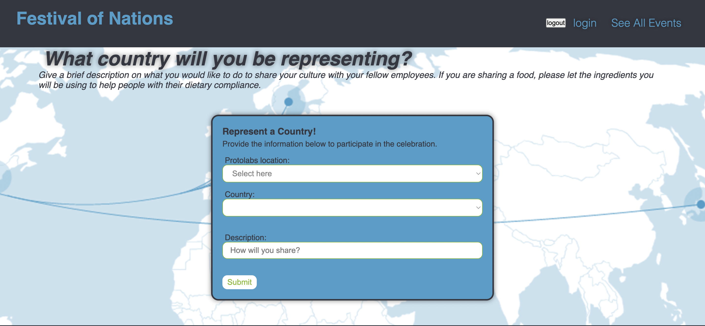
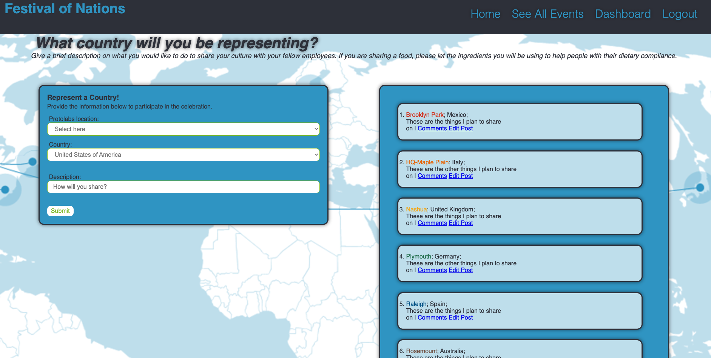

# Festival of Nations

  

  ### Description 
  Protolabs is looking for a way for their employees to sign up for a Diversity Equity and Inclusion (DEI) event called Festival of Nations. Employees can create an account and sign in to a secure website where they can create a post showing which country they would like to represent at the festival. They will have to choose which protalabs campus they are located on and a brief description of what they plan to bring to the event. Participants can comment on each others post to collaborate and share ideas. All contributing posts are visible from the main events page.


  ## Table of Contents
  * [Installation](#installation)
  * [Usage](#usage)
  * [License](#license)
  * [Technology](#technology)
  * [Contributors](#contributors)
  * [Credits](#credits)
  
  
  ## Installation 
  Step 1: Navigate to the [page](https://github.com/Sonarie/festivalOfNations) where the project is hosted 
  
  Step 2: click Fork and fork the project to your github account 
  
  Step 3: Copy the url of the project 
  
  Step 4: In your computer's terminal, navigate to the directory you would like to clone the project into
  
  Step 5: In the terminal type 'git clone' and the url 
  ```
  git clone https://github.com/Sonarie/festivalOfNations
  ```
  
  Step 6: Go to the root folder in terminal 
  ```
  cd festivalOfNations
  ```


  Step 7: Install dependencies by typing npm init and then after answering prompts type npm install
  ```
  npm init
  ```
  ```
  npm install
  ```


  ## Usage 
  To run the program just type npm start in the command line and then navigate to localhost:3030 in your browser or simply visit the live website [here](https://powerful-mesa-61465.herokuapp.com/). 

  Once a user arrives at the landing page they will be able to sign up or log in to their account. They will then receive an email welcoming them to Festival of Nations. From there they will be redirected to a page where they will be able to create a post selecting there Protolabs campus, country they are representing and leaving a brief description. If they do not wish to create a post the user can click 'See All Events' where they can view and comment on all the posts from other users.
  
 Sign up page


Create post page


Dashboard Page


  ## Technology
  node modules used:
  * [bcrypt](https://www.npmjs.com/package/bcrypt)
  * [sequelize](https://www.npmjs.com/package/sequelize)
  * [dotenv](https://www.npmjs.com/package/dotenv)
  * [express](https://www.npmjs.com/package/express)
  * [handlebars](https://www.npmjs.com/package/handlebars)
  * [mysql](https://www.npmjs.com/package/mysql)
  * [nodemailer-sendgrid](https://www.npmjs.com/package/nodemailer-sendgrid)


  ## License 
   


  ## Contributors
  Any questions regarding the project can be directed at any of the following contributors:

  Sara Oros [Github](https://github.com/saraoros) [Email](saragochez13@gmail.com)

  Sonja Watson [Github](https://github.com/Sonarie) [Email](sonarie1980@gmail.com)

  Paul Gottinger [Github](https://github.com/PRGottinger) [Email](paul.gottinger@gmail.com)

  Goodwin Amundson [Github](https://github.com/goodwinamundson) [Email](goodwinamundson@gmail.com)

  ## Credits
  We used inspiration for our code from some of previous projects including:
  * just-tech-news
  * run-buddy
  * readme-generator 


